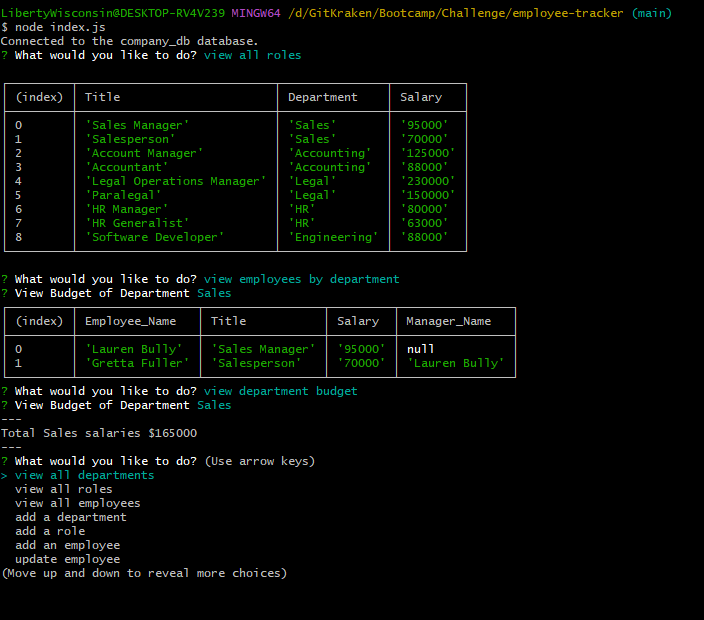
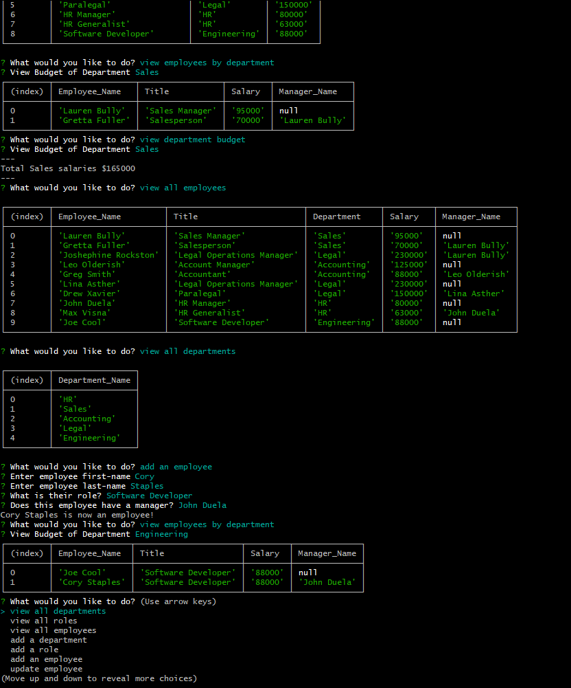

# Employee Tracker
This is a repo to host an Employee tracking application. 
From the command line the user will be able to take on the role of a business owner.
The user can view departments(budgets and employees), Roles within departments and their salaries, as well as view employees and their roles in the company.  
The user can add departments, roles, and employees to the tracker. Also employees can have their roles within the company updated.  

[App Demo Video](https://drive.google.com/file/d/1aTbcCAuj3BAeyBD_AD8IqNUM7W8ATLr7/view?usp=sharing)

## Install/Local Usage
This application requires [Node](https://nodejs.org) to be installed.
Clone the repo, then run 'npm i' inside the directory with the package.json file.
To deploy app locally,
enter password for mysql root user in seedDB.js and db-access.js.  
Run the database setup in 'schema.sql' as mysql root user with 'source schema.sql;  
To setup the app with seed data, in root directory run 'node db/seedDB.js'.
run 'node index' to start the application.
The application should then be running fully within the command line

## Screenshots

## Credits
This app is a CLI [Node](https://nodejs.org) application   
### npm package
[Inquirer](https://www.npmjs.com/package/inquirer)  
[mysql2](https://www.npmjs.com/package/mysql2)  
